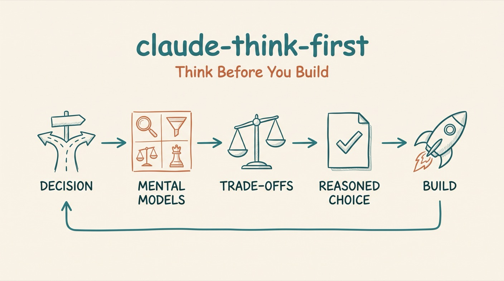

# Think First

*Never implement a significant decision without structured analysis first.*




A Claude Code skill that enforces structured thinking before implementing significant decisions.

## Why

When working quickly with AI assistance, it's tempting to jump straight to implementation. This leads to:

- Architectural decisions made without considering trade-offs
- Solutions that solve the wrong problem
- Missed opportunities for simpler approaches
- The dreaded "we should have thought about that first"

This skill forces a pause to apply mental models before proceeding.

## Install

```bash
# In Claude Code:
/plugin marketplace add aplaceforallmystuff/marketplace
/plugin install claude-think-first@jim-christian
```

<details>
<summary>Manual install (without the marketplace)</summary>

```bash
git clone https://github.com/aplaceforallmystuff/claude-think-first.git
cp -r claude-think-first/skills/think-first ~/.claude/skills/
```
</details>

## Use cases

- Use it when choosing between architectural options ("Redis or PostgreSQL for caching?", "monorepo or multi-repo?").
- Use it when making a business decision — pricing, positioning, or target market.
- Use it when prioritizing features and deciding what to build first.
- Use it when weighing a trade-off (speed vs quality, scope vs time).
- Use it when considering a pivot or change of direction.
- Use it when a decision will be hard to reverse.

## How it works

When you face a significant decision, this skill:

1. **Detects** decision moments (architectural choices, prioritization, trade-offs)
2. **Selects** appropriate mental model(s) for the problem type
3. **Applies** structured analysis using model-specific prompts
4. **Synthesizes** insights into a clear recommendation
5. **Proceeds** only after thoughtful analysis

### Mental models included

| Model | Best For |
|-------|----------|
| **First Principles** | Breaking down to fundamentals, challenging assumptions |
| **Inversion** | "What would guarantee failure?" - avoiding pitfalls |
| **Second-Order** | Consequences of consequences |
| **Opportunity Cost** | What are we giving up by choosing this? |
| **Pareto (80/20)** | Finding highest-leverage actions |
| **Via Negativa** | Improve by removing, not adding |
| **5 Whys** | Drilling to root cause |
| **10-10-10** | Time horizon analysis (10 min/10 mo/10 yr) |
| **Eisenhower Matrix** | Urgent vs Important prioritization |
| **One Thing** | Identifying single highest-leverage action |
| **SWOT** | Strengths, Weaknesses, Opportunities, Threats |
| **Occam's Razor** | Simplest explanation that fits the facts |

### Model selection guide

| Decision Type | Use These Models |
|--------------|------------------|
| What to build | First Principles, Inversion, One Thing |
| How to prioritize | Pareto, Eisenhower Matrix, Opportunity Cost |
| Is this the right direction | Second-Order, 10-10-10, Inversion |
| What are we missing | 5 Whys, Via Negativa, SWOT |
| Which option to choose | Opportunity Cost, First Principles, Occam's Razor |

## Example

The skill activates when Claude detects decision moments:

- "Should we use X or Y?"
- "How should we approach this?"
- "What's the best way to..."
- "Which option makes more sense?"

```
User: Should we use Redis or PostgreSQL for caching?

Claude (with think-first):
=== THINK FIRST: First Principles ===

DECISION: Caching solution selection

ANALYSIS:
1. What problem are we solving?
   - Need faster data retrieval for frequently accessed data

2. What do we KNOW to be true?
   - Our current DB queries are slow (>200ms)
   - We have 10 frequently accessed data patterns
   - Our infrastructure already includes PostgreSQL

3. What assumptions might be wrong?
   - "We need a separate caching layer" - maybe query optimization is enough
   - "Redis is always faster" - depends on the access pattern

4. Simplest solution?
   - Try PostgreSQL materialized views first (no new infrastructure)

KEY INSIGHTS:
- Adding Redis increases operational complexity
- PostgreSQL can handle many caching patterns natively
- Start simple, add complexity only when proven necessary

RECOMMENDATION: Try PostgreSQL-native caching first
=================================
```

## Integration with CLAUDE.md

For automatic enforcement, add this to your `CLAUDE.md`:

```markdown
## Decision Protocol

Before implementing significant decisions, invoke the think-first skill:
- Architectural choices
- Business model decisions
- Feature prioritization
- Trade-off analysis

This ensures mental model application before implementation.
```

## Related Skills

Part of the [aplaceforallmystuff](https://skills.sh/aplaceforallmystuff) skills collection:

- **[rfu-audit](https://github.com/aplaceforallmystuff/claude-rfu-audit)** — 11-gate utility validation before investing effort
- **[creation-guard](https://github.com/aplaceforallmystuff/claude-creation-guard)** — Prevent duplicate artifacts before creating new ones
- **[lessons-learned](https://github.com/aplaceforallmystuff/claude-lessons-learned)** — Structured retrospectives that implement fixes

## License

MIT — see [LICENSE](LICENSE).
